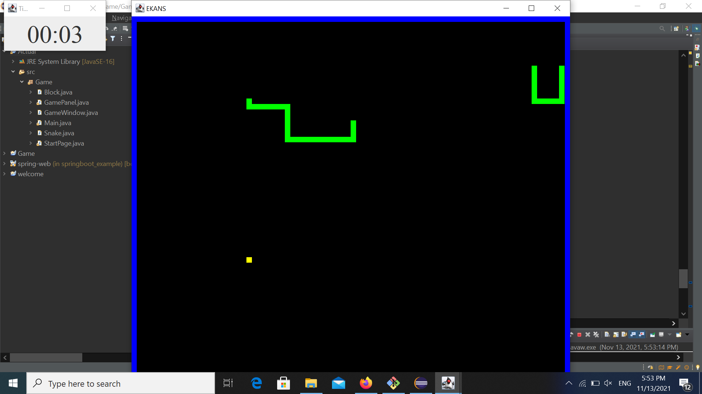
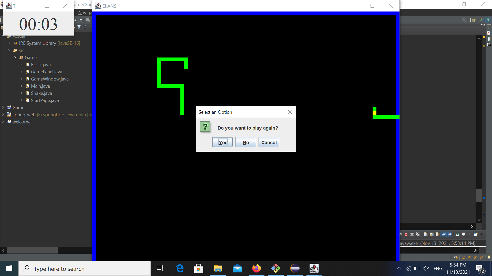

# ENAKS

Language: Java

Teammates: Vincent Lee, Andy Foo, Benedict Neo

## About

We built the classic snake game that everybody loves, but with a twist. We call it reverse snake game – ENAKS.  Instead of being the snake eating the food, the player is the food avoiding the two snakes that are travelling around the game. The goal is to survive as long as possible.

We planned to add a database for user registration, and save the highest score (longest time surviving) but we ran out of time.

## Screenshot of game

Below is image of what the game looks like.

When users lose, a box would appear which prompts them to play again.

